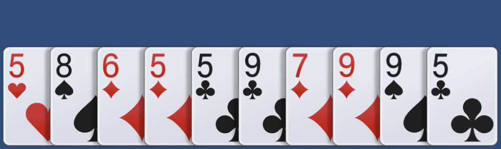
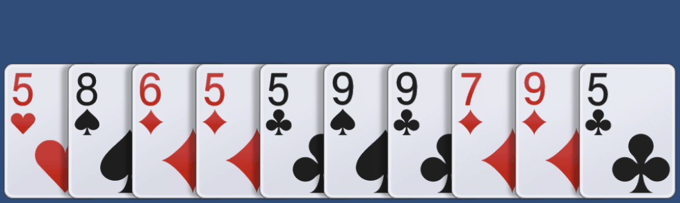

# Interview2022_2

1. Add card selecting and deselecting feature.
- On select, move the card up for certain time.
- On deselect, move the card down instantly.

2. Add card dragging feature.
- On drag start, move the card up instantly.
- On dragging, fix the y position of the card.
- When the dragging card gets closer to another card, move the position of the other card toward the dragging card.
- On drag end, move the card down instantly.

  
Additional Tasks

  

    1. Add sorting feature.
    - Add card info to cards(number and type)
    - Add sort button UI.
    
    
  

  

